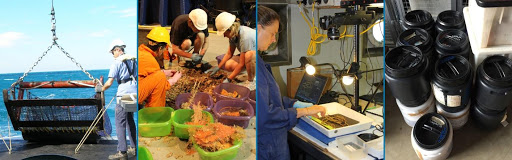

[Rachel Przeslawski](mailto:rachel.przeslawski@ga.gov.au), Franzis Althaus, Malcolm Clark, Jamie Colquhoun, Dan Gledhill, Scott Foster, Tim O’Hara

Chapter citation:
Przeslawski R, Althaus F, Clark M, Colquhoun J, Gledhill D, Flukes E, Foster S, O’Hara T, Proctor R. 2019. Marine sampling field manual for benthic sleds and bottom trawls. In Field Manuals for Marine Sampling to Monitor Australian Waters, Version 2. Przeslawski R, Foster S (Eds). National Environmental Science Program (NESP).

