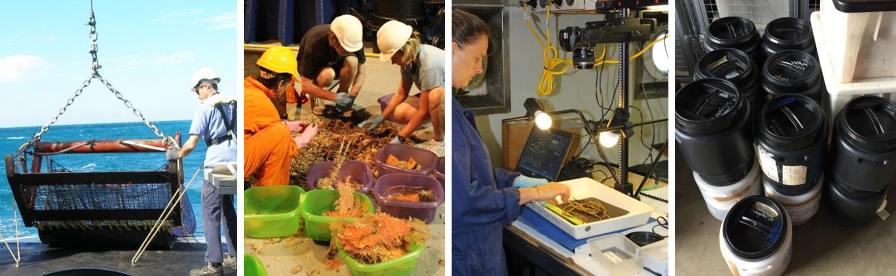

[Rachel Przeslawski](mailto:rachel.przeslawski@ga.gov.au), Franzis Althaus, Lara Atkinson, Malcolm Clark, Jamie Colquhoun, Dan Gledhill, Scott Foster & Tim O’Hara

Chapter citation:
Przeslawski R, Althaus F, Clark M, Colquhoun J, Gledhill D, Flukes E, Foster S, O’Hara T, Proctor R. 2020. Marine sampling field manual for benthic sleds and bottom trawls. In <em>Field Manuals for Marine Sampling to Monitor Australian Waters, Version 2</em>. Przeslawski R, Foster S (Eds). National Environmental Science Program (NESP).